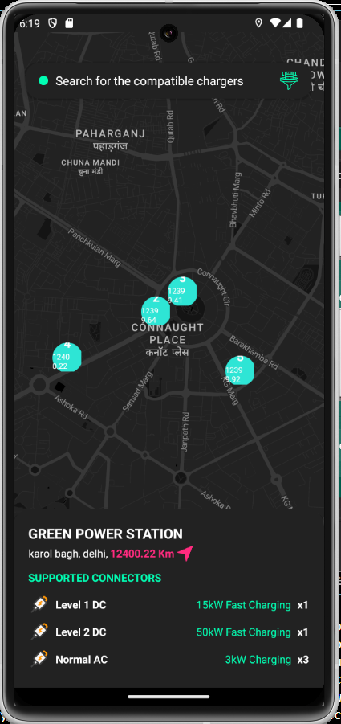

# EV Charger Mobile App

A cross-platform React Native app for discovering and viewing EV charging stations on a map, with screenshot and Google Drive upload support.



- 📍 **Map View:** See all nearby EV charging stations with connector counts.
- 🟣 **Current Location:** Your position is shown as a highlighted pink marker.
- 🗺️ **Dynamic Data:** All charger data loads from a JSON file.
- ⚡ **Charger Details:** Tap a marker to view supported connectors and details.
- 🔍 **Search Bar:** Quickly search for compatible chargers.
- 📸 **Screenshot FAB:** Capture the map and upload it to Google Drive.
- 🟢 **Android & iOS:** Runs on both platforms (React Native, TypeScript, no Expo).

## Project Structure

```
EVChargerApp/
├── src/
│   ├── assets/
│   │   └── data/chargers.json
│   ├── components/
│   │   ├── ChargerInfoCard.tsx
│   │   ├── CustomMarker.tsx
│   │   └── FloatingActionButton.tsx
│   ├── screens/
│   │   └── HomeScreen.tsx
│   ├── services/
│   │   ├── LocationService.tsx
│   │   ├── ScreenshotService.tsx
│   │   └── GoogleDriveService.tsx
│   ├── types/
│   │   └── index.tsx
│   └── App.tsx
```

## Getting Started

### Prerequisites

- Node.js >= 14
- npm or yarn
- Android Studio or Xcode (for running on device/emulator)
- Google Maps API Key (Maps SDK for Android/iOS enabled)
- Google Cloud project with OAuth Web Client ID (for Drive upload)

### Installation

```bash
git clone https://github.com/yourusername/ev-charger-app.git
cd ev-charger-app

npm install
```

### Configuration

1. **Google Maps API Key:**  
   Add your API key to `android/app/src/main/AndroidManifest.xml`:
   ```xml
   
   ```

2. **Google Drive Client ID:**  
   In `src/services/GoogleDriveService.tsx`, replace:
   ```ts
   webClientId: 'YOUR_WEB_CLIENT_ID'
   ```
   with your actual OAuth 2.0 Web Client ID.

3. **Location Permissions:**  
   The app requests location permissions at runtime.

### Running the App

**Android:**
```bash
npx react-native run-android
```

**iOS:**
```bash
cd ios && pod install && cd ..
npx react-native run-ios
```

## Usage

- The map loads with charger markers and your current location.
- Tap a marker to view charger details.
- Use the floating camera button to capture and upload a map screenshot to Google Drive.

## Dependencies

- [react-native-maps](https://github.com/react-native-maps/react-native-maps)
- [react-native-geolocation-service](https://github.com/Agontuk/react-native-geolocation-service)
- [@react-native-google-signin/google-signin](https://github.com/react-native-google-signin/google-signin)
- [react-native-view-shot](https://github.com/gre/react-native-view-shot)
- [react-native-fs](https://github.com/itinance/react-native-fs)
- [react-native-vector-icons](https://github.com/oblador/react-native-vector-icons)

## Screenshots

Add screenshots of your app in the `src/assets/screenshots/` directory and reference them here.

## License

This project is for evaluation purposes only and is not intended for production use.

---
